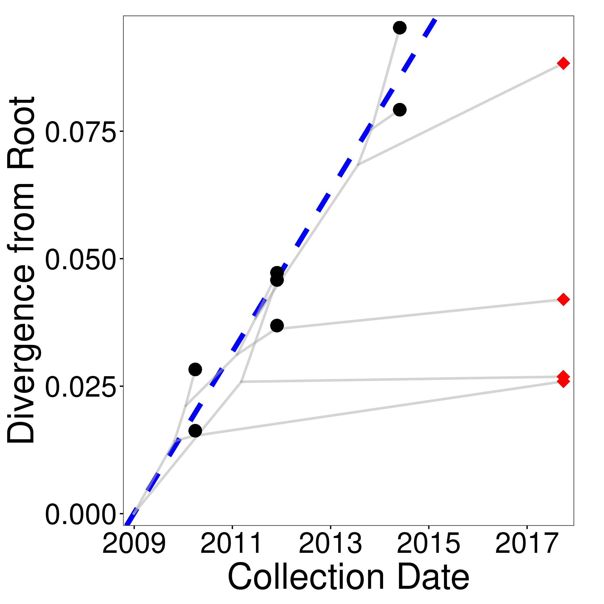

# Phylodating

Phylodating is a web application hosted at https://bblab-hivresearchtools.ca/django/tools/phylodating/. R scripts for Phylodating can be found in this repository's scripts folder.

Phylodating estimates unknown sequence ages from a phylogenetic tree inferred from longitudinally sampled sequences ("calibration sequences") and sequences with unknown ages ("query sequences") that have been isolated from the same individual. Calibration sequences are used to calibrate a linear regression that relates the root-to-tip distances of these sequences to their sampling times, which is then used to estimate the establishment dates of the query sequences. The methodology was developed to estimate the integration dates of HIV DNA sequences persisting in the reservoir, as described in:

Jones, B. R., et al. (2018) Phylogenetic approach to recover integration dates of latent HIV sequences within-host. PNAS 115 (38): E8958-E8967. doi: [10.1073/pnas.1802028115][1].

To estimate integration dates of HIV reservoir sequences, you must provide two files. First, you must provide a single unrooted phylogenetic tree inferred from plasma-derived HIV RNA sequences collected over at least 3 time points prior to therapy initiation ("calibration sequences") along with HIV sequences collected from the reservoir ("query sequences"). The latter may comprise proviral sequences collected during suppressive therapy, or HIV sequences sampled following treatment discontinuation (under the assumption that these represent sequences emerging from the reservoir). Second you must provide an "info" CSV file listing each sequence in the phylogeny, its sampling date, and specifying whether the sequence should be treated as "calibration" (i.e. data used to calibrate the linear regression; coded as "0") or "query" (sequences for which date estimation is required; coded as "1"). Note that collection date is required for all sequences, even query sequences, if you want to generate the divergence versus time plot. Additional details of these two input files are given below.

We take security and confidentiality very seriously. Please, DO NOT upload sequence data to Phylodating, and ensure that your phylogenies and input files DO NOT contain personally identifying information. Data generated by Phylodating will deleted from our servers after 7 days.

Phylodating generates four files: a newick file containing a rooted version of the input tree, a csv file containing information on the linear model parameters and model fitness, a csv file containing the estimated dates and a divergence versus time plot of the sequences. If the data contains a sufficient molecular clock signal to perform the linear regression then the Model Fit column of the stats.csv file will be 1 and the divergence versus time plot will be created; otherwise the Model Fit column of the stats.csv file will be 0 and the divergence versus time plot will not be created. Details of the four files produced by Phylodating (rooted_tree.nwk, stats.csv, data.csv, divergence_vs_time.pdf) are given below.

### Email (optional)

We will use this to email you with a unique URL to check your job's status and download your results

### Info csv

A comma separated file containing information on each sequence in the phylogeny. The file must have at least three columns labeled and described as follows:

* ID - the sequence IDs exactly matching the tip labels of the unrooted tree.
* Date - collection date in the format yyyy-mm-dd (e.g. 2018-09-18).
* Query - 0 if the sequence is to be used to calibrate the linear regression, and 1 otherwise. Usually, pre-therapy plasma HIV sequences are coded as 0 and HIV reservoir sequences are coded as 1.

*Note that collection date is required for all sequences if you wish to generate the divergence versus time plot*

Please ensure that input files DO NOT contain any personally identifying information

Example:

    ID,Date,Query
    RNA1,2011-03-08,0
    RNA2,2011-03-08,0
    RNA3,2012-11-05,0
    RNA4,2012-11-05,0
    RNA5,2012-11-05,0
    RNA6,2015-05-07,0
    RNA7,2015-05-07,0
    DNA1,2018-09-05,1
    DNA2,2018-09-05,1
    DNA3,2018-09-05,1
    DNA4,2018-09-05,1

### Unrooted tree

An unrooted phylogeny (newick tree file) inferred from the query and calibration sequences contained in the CSV file.

*Tip labels must exactly match sequence IDs in the info CSV file.*
 
A note on identical HIV sequences: Identical HIV sequences commonly occur in within-host HIV sequence datasets. While phylodating will accept tree files containing terminal branches of zero length (caused by identical sequences), large numbers of identical calibration sequences can bias the regression. Similarly, large numbers of identical query sequences can bias the average inferred sequence ages in the dataset. To avoid this, consider identifying identical HIV sequences in the calibration dataset, and include only the earliest instance of each sequence when inferring your phylogeny. As for query sequences, consider whether you are primarily interested in the age distribution of distinct HIV sequences only, or whether you are interested in the age distribution of all sequences. If the former, restrict the query dataset to distinct HIV sequences before inferring your phylogeny.

Example:

    (DNA1:0.000857,(RNA1:0.001053,((RNA5:0.019962,DNA3:0.001):0.040048,(RNA2:0.007126,((DNA2:0.005841,RNA3:0.000712):0.004969,(RNA4:0.008952,(DNA4:0.019875,(RNA6:0.003845,RNA7:0.01993):0.006931):0.030149):0.007087):0.010048):0.00697):0.001021):0.009876);

## Outputs:

Phylodating produces a zipped archive containing four files, as follows.

### rooted_tree.nwk

A rooted version of the input tree, where the root is chosen to maximize the correlation between sampling time of calibration sequences and their divergence from the root.

Example:

    (((DNA1:0.010733,RNA1:0.001053):0.001021,(RNA2:0.007126,((DNA2:0.005841,RNA3:0.000712):0.004969,(RNA4:0.008952,(DNA4:0.019875,(RNA6:0.003845,RNA7:0.01993):0.006931):0.030149):0.007087):0.010048):0.00697):0.01418479131,(RNA5:0.019962,DNA3:0.001):0.02586320869);

### stats.csv

A comma separated file that contains information about the linear regression performance and parameters. The columns included are:

* RunID - run ID of the job created by Phylodating.
* dAIC - difference between the Akaike Information Criteria of the null model (where the regression’s slope is zero) and the linear regression inferred from the data.
* EstimateRootDate - estimated root date of the tree calculated by the linear regression in the format yyyy-mm-dd.
* EstimatedRootDate95Low - lower bound of the 95% confidence interval of the estimated root date in the format yyyy-mm-dd.
* EstimatedRootDate95High - upper bound of the 95% confidence interval of the estimated root date in the format yyyy-mm-dd.
* EstimatedEvolutionaryRate - estimated evolutionary rate calculated by the linear regression in substitutions per site per day.
* Fit - the model fit. Designated as 1 if the linear regression passes both predefined quality control criteria (dAIC > 10, and the lower bound of the 95% confidence interval of the estimated root date precedes the earliest collection date) and 0 otherwise.

Example:

    "RunID","dAIC","EstimatedRootDate","EstimatedRootDate95Low","EstimatedRootDate95High","EstimatedEvolutionaryRate","Fit"
    "12528060",17.1483031836612,"2009-12-06","2008-04-08","2011-08-04",4.32745826454141e-05,1

### data.csv

A comma separated file containing the estimated dates. The columns included are:

* ID - the sequence ID.
* Date - collection date in the format yyyy-mm-dd, as indicated in the user input file
* Query - 0 if the sequence is used to calibrate the linear regression, and 1 otherwise, as indicated in the user input file
* EstimatedDate - estimated date in the format yyyy-mm-dd.
* EstimatedDate95Low - lower bound of the 95% confidence interval of the estimated date in the format yyyy-mm-dd.
* EstimatedDate95High - upper bound of the 95% confidence interval of the estimated date in the format yyyy-mm-dd.

Example:

    "ID","Date","Query","EstimatedDate","EstimatedDate95Low","EstimatedDate95High"
    "DNA1","2018-09-05",1,"2011-07-28","2010-02-19","2013-01-02"
    "DNA3","2018-09-05",1,"2011-08-18","2010-03-14","2013-01-21"
    "DNA2","2018-09-05",1,"2012-08-02","2011-03-22","2013-12-15"
    "DNA4","2018-09-05",1,"2015-07-08","2013-12-21","2017-01-23"
    "RNA1","2011-03-08",0,"2010-12-16","2009-06-15","2012-06-18"
    "RNA2","2011-03-08",0,"2011-09-20","2010-04-19","2013-02-20"
    "RNA5","2012-11-05",0,"2012-10-29","2011-06-20","2014-03-11"
    "RNA3","2012-11-05",0,"2012-04-06","2010-11-18","2013-08-24"
    "RNA4","2012-11-05",0,"2012-12-01","2011-07-23","2014-04-12"
    "RNA6","2015-05-07",0,"2014-12-10","2013-06-21","2016-05-30"
    "RNA7","2015-05-07",0,"2015-12-17","2014-05-06","2017-07-28"

### divergence_vs_time.pdf

A graphic relating root-to-tip divergence of the sequences versus their collection dates. Black circles represent calibration sequences and red diamonds represent query sequences. The blue dotted line denotes the linear regression and the grey lines denote the ancestral (phylogenetic) traces. An example plot is shown below.

Will only be generated if the regression fits and all tip dates are given.

Example:

[1]: https://doi.org/10.1073/pnas.1802028115
